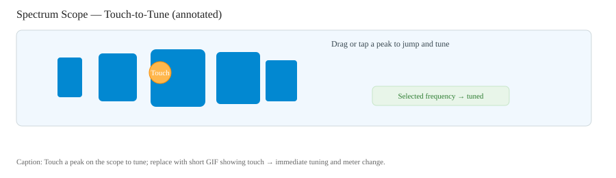

# Touch Screen and Menu System Mastery

The IC-7300's 4.3-inch touch screen is one of its most powerful features. This chapter provides comprehensive guidance on using the touch interface effectively, navigating the menu system, and configuring the radio for optimal operation.

## Understanding the Main Display

### Display Layout Overview

The main operating screen is divided into several functional areas:

```
┌─────────────────────────────────────────────────────────────┐
│  VFO A    14.074.00   USB-D    FIL1    │ [SPLIT] [RIT] [XIT]│
├─────────────────────────────────────────────────────────────┤
│  ████████████████░░░░░░░░░░░░░░░░░░░░░░░░░░  S9+20        │
│  S-METER / POWER / SWR / ALC                               │
├─────────────────────────────────────────────────────────────┤
│                                                             │
│                    SPECTRUM SCOPE                           │
│                    (Waterfall Display)                      │
│                                                             │
├─────────────────────────────────────────────────────────────┤
│ [MODE] [SCOPE] [FILTER] [MULTI] [DATA] [TUNER] [VOX]       │
└─────────────────────────────────────────────────────────────┘
```

### Frequency Display

**Main Frequency Readout:**
- Shows current operating frequency
- Touch the **MHz** digits to access band selection
- Touch the **kHz** digits for direct frequency entry
- The decimal point position indicates tuning step

**Touch Interactions:**
| Area Touched     | Action                                |
| ---------------- | ------------------------------------- |
| MHz digits       | Opens band stack/selection menu       |
| kHz digits       | Opens numeric keypad for direct entry |
| Mode indicator   | Opens mode selection menu             |
| Filter indicator | Cycles through FIL1/FIL2/FIL3         |

### VFO Indicators

The IC-7300 has two VFOs (A and B) for flexible operation:

- **VFO A/B**: Shows which VFO is active
- **SPLIT**: Indicates split frequency operation
- **RIT**: Receiver Incremental Tuning active
- **XIT**: Transmitter Incremental Tuning active

**To Switch VFOs:**
1. Touch **A/B** on the screen, or
2. Press the **A/B** button if shown in function menu

### Meter Display

The meter bar can show different measurements:

| Meter Type | When Shown   | What It Measures               |
| ---------- | ------------ | ------------------------------ |
| S-Meter    | Receiving    | Signal strength (S-units)      |
| Power      | Transmitting | RF output power (watts)        |
| SWR        | Transmitting | Standing Wave Ratio            |
| ALC        | Transmitting | Automatic Level Control        |
| COMP       | Transmitting | Compression level (if enabled) |

**To Change Meter Display:**
- Touch the meter area to cycle through options
- During transmit, you can monitor SWR or ALC

---

## Touch Screen Operation

### Touch Gestures

The IC-7300 supports several touch gestures:

**Single Tap:**
- Select menu items
- Activate on-screen buttons
- Change settings

**Touch and Hold:**
- Access additional options for some items
- Copy frequencies between VFOs

**Drag/Swipe:**
- Scroll through menu lists
- Adjust slider controls
- Pan the spectrum scope display

### On-Screen Keyboard

When entering text or numbers:

**Numeric Keypad:**
- Appears for frequency entry
- Touch digits 0-9
- **ENT** confirms entry
- **CE** clears last digit
- **CLR** clears entire entry

**Alpha Keyboard:**
- Used for call signs, memory names
- Toggle between upper/lower case
- Special characters available

**Frequency Entry Tips:**
- Enter frequency in kHz (e.g., 14074 for 14.074 MHz)
- No need to enter trailing zeros
- Press **ENT** immediately after last digit

---

## Spectrum Scope Operation

The spectrum scope is one of the IC-7300's most valuable features for finding stations.

### Scope Display Modes

**Center Mode:**
- Operating frequency is at center of display
- Equal spectrum shown on both sides
- Best for monitoring around your frequency

**Fixed Mode:**
- Display edges are fixed to specific frequencies
- Operating frequency marker moves as you tune
- Best for monitoring a band segment

**To Switch Modes:**
1. Touch the scope display
2. Touch **Center** or **Fixed** at the bottom
3. Or press **SCOPE** button repeatedly

### Adjusting Scope Settings

**Span (Frequency Range):**
1. Touch scope display
2. Touch **SPAN** 
3. Select range: ±2.5, ±5, ±10, ±25, ±50, ±100, ±250, ±500 kHz

**Reference Level (Vertical Scale):**
1. Touch scope display
2. Touch **REF** 
3. Adjust with MULTI knob or touch +/- buttons
4. Lower values = more sensitive display

**Speed (Update Rate):**
1. Touch scope display  
2. Touch **SPEED**
3. Choose FAST, MID, or SLOW
4. Faster = smoother display but uses more processing power

### Waterfall Display

The waterfall shows signal history as a scrolling display:

**Reading the Waterfall:**
- Strong signals appear bright (yellow/red)
- Weak signals appear dim (blue/green)
- Horizontal traces indicate carriers
- Vertical lines indicate drifting signals
- Intermittent traces are SSB voice signals
- Regular patterns may be digital modes

**Tuning from Waterfall:**
1. Spot a signal on the waterfall
2. Touch it directly
3. The radio tunes to that frequency
4. Fine-tune with main dial for best audio


*Caption: Touch and double‑touch behaviors illustrated (placeholder). Replace with a short GIF that shows touch → double‑touch → tuned result.*

**Waterfall Tips from Experience:**
- Narrow CW signals appear as thin bright lines
- SSB signals look like fuzzy, irregular traces
- FT8/FT4 signals appear as short horizontal dashes
- PSK31 appears as very narrow, rhythmic traces
- Carriers/beacons appear as continuous vertical lines

### Mini Scope vs Full Scope

**Mini Scope:**
- Smaller display in corner
- Leaves room for other information
- Toggle with **SCOPE** button

**Full Scope:**
- Larger, more detailed display
- Easier to see weak signals
- Toggle with **SCOPE** button

---

## Menu System Navigation

### Accessing Menus

**MENU Button** - Main configuration menus:
- **SET**: Radio configuration settings
- **CONNECTORS**: Audio and interface settings
- **DISPLAY**: Screen and appearance
- **SOUNDS**: Beeps and sidetone
- **TIME SET**: Clock configuration
- **SD CARD**: Memory card operations
- **OTHERS**: Miscellaneous settings

**QUICK Button** - Context-sensitive quick settings:
- Options change based on current mode
- Fast access to frequently changed settings

**FUNCTION Button** - Operating function toggles:
- NB (Noise Blanker)
- NR (Noise Reduction)
- NOTCH (Auto/Manual Notch Filter)
- COMP (Compression)
- AGC (Automatic Gain Control)
- MONITOR (Self-monitor)

### Menu Navigation Tips

1. **Scroll through lists** by touching and dragging
2. **Touch an item** to select it
3. **Use MULTI knob** to change values quickly
4. **Press EXIT** to go back one level
5. **Press EXIT repeatedly** to return to main display

### Important Menu Settings

#### SET → Connectors (Critical for Setup)

**CI-V Settings (Computer Control):**
| Setting            | Recommended Value  | Purpose                     |
| ------------------ | ------------------ | --------------------------- |
| CI-V Baud Rate     | 115200             | Fast computer communication |
| CI-V Address       | 94 (default)       | Radio's unique address      |
| CI-V USB Echo Back | ON                 | Required for most software  |
| CI-V USB Port      | Unlink from REMOTE | Separate USB from CI-V jack |

**USB Audio Settings:**
| Setting             | Recommended Value | Purpose                     |
| ------------------- | ----------------- | --------------------------- |
| DATA MOD            | USB               | Audio source for DATA modes |
| USB MOD Level       | 50%               | Transmit audio level        |
| USB AF Output Level | 50%               | Receive audio level         |

#### SET → Display

| Setting       | Recommendation      | Notes                      |
| ------------- | ------------------- | -------------------------- |
| LCD Backlight | Personal preference | Dimmer saves power         |
| Display Font  | Basic or Round      | Round is easier to read    |
| Memory Name   | ON                  | Shows memory channel names |
| My Call       | Your call sign      | Displayed on screen        |

#### SET → Function

**AGC (Automatic Gain Control):**
- FAST: For rapidly changing signals (SSB)
- MID: General purpose
- SLOW: For CW and weak signal work

**Noise Blanker/Reduction:**
- Configure default NB and NR levels
- Higher NR can cause audio artifacts

---

## Finding Stations

### Using the Spectrum Scope

**Step-by-Step Signal Hunting:**

1. **Select the band** you want to explore
2. **Enable the spectrum scope** (press SCOPE)
3. **Set an appropriate span** (±25 to ±100 kHz for hunting)
4. **Lower the reference level** until you see the noise floor
5. **Look for signals** rising above the noise
6. **Touch a signal** to tune to it
7. **Fine-tune with main dial** for best audio

### Recognizing Signal Types

**SSB (Voice) Signals:**
- Appearance: Irregular, fuzzy traces that vary with speech
- Sound: Voice audio (may sound like Donald Duck if off-frequency)
- Tuning: Adjust until voice sounds natural (not too high or low pitched)

**CW (Morse Code) Signals:**
- Appearance: Thin, steady lines that key on/off
- Sound: Musical tones (dits and dahs)
- Tuning: Center the tone at your preferred pitch (usually 600-800 Hz)

**Digital Mode Signals:**
- FT8: Regular spaced vertical marks
- PSK31: Very narrow, rhythmic patterns
- RTTY: Twin parallel traces
- Sound: Various tones, warbles, or noise-like sounds

**Noise and Interference:**
- Broadband noise: Grass-like appearance across entire display
- Carrier: Single continuous vertical line
- Powerline noise: Regular spaced pulses
- Computer noise: Regular patterns, often harmonically related

### Using the Band Scope Effectively

**For Weak Signal Work:**
1. Set SPAN to ±5 or ±10 kHz
2. Lower REF level until weak signals visible
3. Set SPEED to SLOW for better sensitivity
4. Look for signals just above the noise floor

**For Contest/Busy Bands:**
1. Set SPAN to ±50 or ±100 kHz
2. Raise REF level if display is too cluttered
3. Set SPEED to FAST for quick updates
4. Scan for open frequencies

---

## SWR Measurement and Antenna Evaluation

### Checking SWR

**Quick SWR Check:**
1. Set mode to **CW** (produces steady carrier)
2. Reduce power to 10W (MULTI → RF POWER)
3. Touch the meter display, select **SWR**
4. Press **TRANSMIT** to key the radio
5. Read SWR value
6. Press **TRANSMIT** again to stop

**SWR Interpretation:**

| SWR Value    | Assessment    | Action            |
| ------------ | ------------- | ----------------- |
| 1.0:1        | Perfect match | None needed       |
| 1.5:1        | Excellent     | Operate normally  |
| 2.0:1        | Good          | Tuner optional    |
| 2.5:1        | Acceptable    | Use tuner         |
| 3.0:1        | Marginal      | Tuner required    |
| >3.0:1       | Poor          | Fix antenna!      |
| ∞ (infinite) | No load       | Check connections |

### Using the Internal Antenna Tuner

**Basic Tuner Operation:**

1. **Enable tuner**: Press **TUNER** once
   - TUNE icon appears on screen (not highlighted)
   
2. **Initiate tuning**: Hold **TUNER** for 1 second
   - Radio transmits briefly
   - TUNE icon blinks during tuning
   - Tuning takes 2-5 seconds
   
3. **Verify match**: Check SWR after tuning
   - Should be below 1.5:1
   - Tuner memorizes settings for this frequency

**Tuner Tips:**
- The tuner works best with SWR below 3:1
- For higher SWR, use "Emergency" mode (MENU → SET → Function → Tuner)
- Tuner settings are remembered per frequency segment
- If tuner can't find a match, check your antenna

### Evaluating Antenna Health

**Signs of a Healthy Antenna:**
- Low SWR across the intended bandwidth
- SWR minimum near the design frequency
- Gradual SWR increase toward band edges
- Consistent readings over time

**Signs of Antenna Problems:**
- Erratic SWR readings
- SWR that changes when you touch the coax
- High SWR on all frequencies
- SWR that changes with weather
- Sudden change from previously good readings

**Diagnostic Steps:**

1. **Check connections:**
   - Inspect PL-259 connector at radio
   - Check antenna feedpoint connection
   - Look for corroded or loose connections

2. **Test the feedline:**
   - Disconnect antenna, connect dummy load at far end
   - Should show near-perfect SWR
   - If not, coax may be damaged

3. **Inspect the antenna:**
   - Look for broken elements
   - Check insulators for cracks
   - Verify proper element lengths
   - Check for water ingress at feedpoint

---

## Microphone Operation

### Using the HM-219 Hand Microphone

**Physical Controls:**
- **PTT (Push-To-Talk)**: Side bar - press to transmit
- **UP/DOWN buttons**: Change frequency
- **FUNC button**: Access special functions

**Holding Technique:**
1. Hold mic 2-4 inches from mouth
2. Speak across the mic, not directly into it
3. Use normal conversational voice level
4. Don't shout or whisper

### Microphone Settings

**Access Mic Settings:**
1. Press **MENU** → **SET** → **Connectors**
2. Find microphone-related settings

**Key Settings:**

| Setting            | Range    | Recommendation                      |
| ------------------ | -------- | ----------------------------------- |
| MIC Gain           | 0-100%   | Start at 50%, adjust by monitoring  |
| COMP (Compression) | OFF/1-10 | OFF for local, 3-5 for DX           |
| Monitor            | ON/OFF   | ON to hear yourself while adjusting |

### Setting Proper Audio Level

**The Goal:** Full, clear audio without overdriving the transmitter.

**Method 1 - Using ALC Meter:**
1. Enable MONITOR function to hear your audio
2. Set meter to show ALC
3. Transmit and speak normally
4. Adjust MIC Gain until ALC peaks occasionally
5. ALC should move slightly, not pin at maximum

**Method 2 - Using a Monitor Receiver:**
1. Have another radio or web SDR monitor your signal
2. Transmit and speak normally
3. Adjust until audio sounds full but not distorted
4. Ask for audio reports from other stations

**Method 3 - Power Output Monitoring:**
1. Set meter to show Power
2. Transmit and speak normally
3. Watch power meter swing with your voice
4. Should swing from about 20% to full power
5. Continuous maximum indicates over-modulation

### Compression Settings

**What Compression Does:**
- Evens out audio level variations
- Increases average power output
- Improves readability on marginal paths

**When to Use Compression:**
- DX (long distance) contacts
- Contests
- Marginal band conditions
- Weak signal situations

**When to Avoid Compression:**
- Local contacts
- Nets where full copy is easy
- When requested to turn it off (over-compressed audio is fatiguing)

**Setting Compression:**
1. Press **FUNCTION** to access COMP
2. Start with COMP level of 3-4
3. Listen with MONITOR on
4. Increase only if needed for DX
5. Watch ALC - should not pin

---

## Quick Menu System

The **QUICK** button provides fast access to commonly changed settings, with options varying by mode.

### QUICK Menu by Mode

**SSB Mode Quick Menu:**
- RIT (Receiver Incremental Tuning)
- ΔTX (Transmit offset)
- MIC Gain
- RF Power
- VOX
- COMP

**CW Mode Quick Menu:**
- RIT
- CW Pitch
- Keyer Speed
- Side tone level
- Break-in mode

**FM Mode Quick Menu:**
- Tone (CTCSS)
- DTCS
- Offset direction
- Offset frequency
- VOX

### Using RIT (Receiver Incremental Tuning)

**Purpose:** Offset your receive frequency without changing transmit frequency.

**When to Use RIT:**
- Other station is slightly off frequency
- Fine-tuning SSB audio pitch
- Compensating for drift

**To Use RIT:**
1. Press **QUICK** → **RIT**
2. Touch to enable RIT
3. Use MULTI knob to adjust offset
4. Offset displayed on screen (e.g., +0.3 kHz)
5. To clear, touch RIT display and reset to zero

---

## Function Menu Deep Dive

The **FUNCTION** button cycles through operating enhancements.

### Noise Blanker (NB)

**Purpose:** Eliminates pulse-type interference (ignition noise, electric fences).

**Settings:**
- NB Level: 1-10 (start at 5)
- NB Depth: How aggressively it blanks
- NB Width: Pulse width it targets

**Best Practices:**
- Start with low NB level and increase as needed
- Too high can cause audio distortion
- Most effective against repetitive pulse noise
- Less effective against continuous noise

### Noise Reduction (NR)

**Purpose:** DSP-based reduction of random background noise.

**Settings:**
- NR Level: 1-15 (start at 5-8)

**Best Practices:**
- Very effective for improving weak signal readability
- Higher levels can cause "underwater" or "robotic" audio
- Find the level where noise decreases but speech remains natural
- Can be used together with NB

### Notch Filter

**Auto Notch:**
- Automatically finds and removes carriers
- Good for eliminating heterodynes (whistles)
- May affect wanted CW signals

**Manual Notch:**
- You control the notch frequency
- Use MULTI knob to position the notch
- Better when auto notch is confused by multiple carriers

### AGC (Automatic Gain Control)

**Purpose:** Automatically adjusts receiver gain to maintain consistent audio level.

**Settings:**
- FAST: Quick response, good for SSB
- MID: Balanced response
- SLOW: Gradual response, good for CW
- OFF: Manual gain control only

**When to Adjust AGC:**
- Use FAST for normal SSB operation
- Use SLOW for weak CW signals (less pumping)
- Try MID for digital modes
- OFF when you want full manual control

---

## Summary: Menu Navigation Cheat Sheet

| Button   | Access             | Common Uses                  |
| -------- | ------------------ | ---------------------------- |
| MENU     | Full configuration | Initial setup, deep settings |
| QUICK    | Context-sensitive  | RIT, power, VOX, compression |
| FUNCTION | Operating aids     | NB, NR, Notch, AGC           |
| SCOPE    | Display control    | Span, speed, reference level |
| FILTER   | Receive bandwidth  | Wide/medium/narrow selection |

**Pro Tips:**
- Learn the QUICK menu for your most-used mode
- Configure FUNCTION settings once, then toggle as needed
- Use SCOPE settings aggressively - they make a huge difference
- Don't be afraid to explore the MENU system - you can't break anything!
