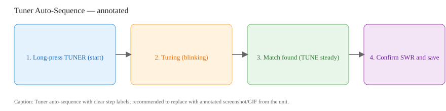
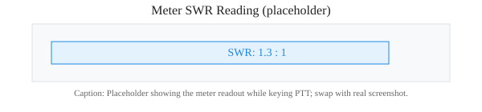

# SWR Tuning (How‑to)

This how‑to provides concise, step‑by‑step procedures for measuring and reducing Standing Wave Ratio (SWR) on the IC‑7300. It is presented in a neutral tone and includes cross‑references to the Antenna & SWR chapter and troubleshooting flows.

## Overview

SWR indicates impedance matching between the transmitter and antenna system. This guide covers safe measurement, use of the internal tuner, interpretation of results, and basic remedial actions.

**Key targets**
- Ideal: < 1.5:1
- Acceptable for operation: < 2:1
- Use caution and reduce power: 2.0–3.0:1
- Do not transmit normally: > 3.0:1 (investigate)

## Preconditions

1. Ensure the transceiver is connected to the intended antenna or a dummy load.
2. Verify power supply at 13.8 V nominal.
3. Use low power for tuning (5–10 W recommended) to reduce risk.
4. If available, have an external SWR meter or antenna analyzer for verification.

## Step‑by‑step procedure

1. Set RF power to a low value (5–10 W).  
2. Bypass the internal tuner to measure the antenna directly: press **TUNER** until the TUNE icon disappears.  
3. Select the operating frequency to be used.  
4. Use a steady carrier (for example, the TUNE function) for a stable reading.  
5. Select the meter display and choose **SWR**.  
6. Key the transmitter briefly (PTT or TUNE carrier) and read the SWR on the meter.  
7. Record the measurement and release the PTT.

### If SWR is acceptable
- Re‑enable the tuner if desired and continue normal operation.  
- Optionally store tuner settings by allowing the tuner to memorize matches at the operating frequencies (hold **TUNER** to auto‑tune).

### If SWR is high (> 2:1)
1. Reduce output power.  
2. Inspect coax and connectors for damage, corrosion, or loose fittings.  
3. Verify the radio and cable with a known good dummy load at the feed point; a 1:1 result indicates the antenna is the likely issue.  
4. Measure SWR at low, center and high band points to determine resonance and bandwidth (see SWR Plot in the Antenna & SWR chapter).  
5. If required, enable the tuner and run auto‑tune (hold **TUNER**). If auto‑tune cannot achieve an acceptable match, follow the troubleshooting flow.

## Reading SWR on transmit safely
- Always use low power when keying to measure SWR.  
- Do not touch the antenna or feedline while transmitting.  
- If available, use a dummy load when diagnosing suspected antenna problems.

### Visual cues (annotated images)

*Caption: Tuner auto‑sequence: long‑press **TUNER** → tuning (blinking) → TUNE steady → confirm SWR.*

*Caption: Annotated meter readout showing SWR and ALC; replace with captured images or short GIFs when available.*

## Examples

**Example 1 — Simple tuning**
- Band: 20 m, Frequency: 14.200 MHz, Measured SWR: 3.0:1.
- Steps: Reduce power to 5 W → verify connectors → test dummy load → enable tuner and start auto‑tune → recheck SWR.

**Example 2 — Plot and inspect**
- Use the SWR Plot function (MENU > SCOPE SET > SWR Plot) to identify resonant frequency and bandwidth.

## Troubleshooting and links
- If SWR remains high after the steps above, see the troubleshooting flow: [High SWR on Transmit](../chapters/12_troubleshooting.md#high-swr-on-transmit).  
- For background information, see the Antenna & SWR chapter: [Antenna & SWR](../chapters/06_antenna_swr.md).  
- For a concise pre‑transmit checklist, see: [Safe First Transmission & SWR Verification](./safe_first_transmission.md).  

## Safety and best practice
- Never touch the antenna or coax during transmit.  
- Use a good quality dummy load for testing and an external SWR meter when available.  
- Keep records of tuner memory points for common frequencies.

---

*See also: [Scan for broadcasts (How‑to)](../howtos/scan_for_broadcasts.md) and the [Quick Reference Card](../chapters/14_quick_reference_card.md).*